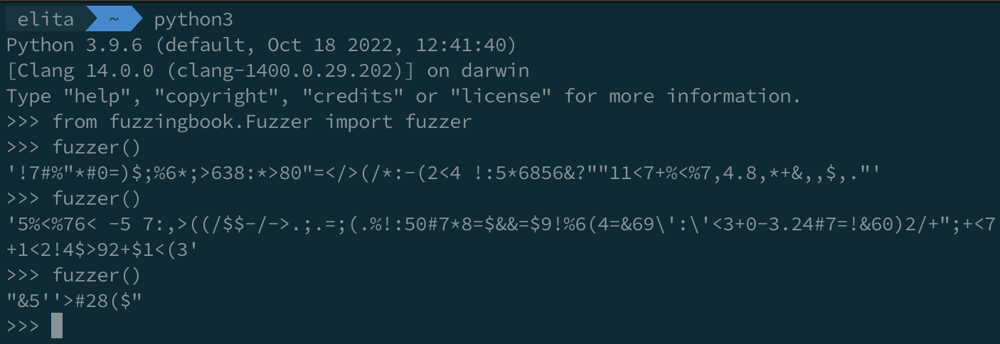

# Generating Random Inputs for Fuzzing

- First, install the fuzzingbook:
    - `pip3 install fuzzingbook`
- Next, open the python interpreter:
    - `python3`
- Then, import the fuzzer:
    - `from fuzzingbook.Fuzzer import fuzzer`
- Then, simply run the fuzzer method to generate random inputs:
    - `fuzzer()`
    - Can easily produce 100's of thousands inputs per second
    

From here you can input these values into a unix program of your choice.